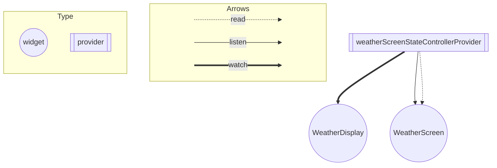

## アーキテクチャ
presentation(screen or screen + controller) - model

### presentation
画面への表示、表示ロジックを担当

- screen: 各画面とその表示に必要なものの集まり。
    - modelとのやりとりが発生、肥大化する場合はscreenだけでなく別途controllerクラスを用意
    - 状態管理が必要な場合はRiverpodで行う
- components: 特定の画面に依存しないUIのパーツ

### model
特定の画面に依存しない、アプリ内で利用するデータやそのデータに関する処理、またデータの取得を担当